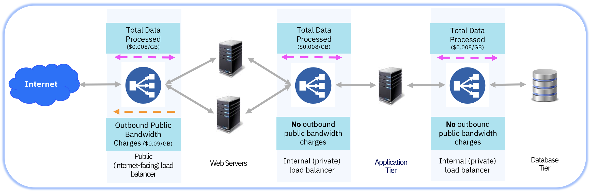

---

copyright:
  years: 2017
lastupdated: "2018-03-14"

---

{:shortdesc: .shortdesc}
{:new_window: target="_blank"}
{:codeblock: .codeblock}
{:pre: .pre}
{:screen: .screen}
{:tip: .tip}
{:download: .download}

# Pricing

IBM Cloud Load Balancer pricing is based on the following three metrics, calculated monthly:

* Service Usage Hours
* Data Processed
* Outbound Public Bandwidth (Egress)

**NOTE:** All prices vary by geographic regionThe Outbound public bandwidth consumed by the IBM Cloud Load Balancer service is billed per the standard data transfer charge of [USD $0.09 per GB](https://www.ibm.com/cloud/bandwidth).

The following chart details an example IBM Cloud Load Balancer priced for a customer using 4500 GB per month for public load balancing:

| | Monthly | Rate | Cost |
| ------------- | ------------- | ------------- | ------------- |
| **Service Usage** | 720 hours | $0.025/hour | $18/month |
| **Data Processed** | 4500GB | $0.008/GB | $36/month |

The total charge for the above scenario is $54/month plus the standard data transfer charge [USD $0.09 per GB](https://www.ibm.com/cloud/bandwidth).

**NOTE:** All prices vary by geographic region; pricing in example and diagram is Dallas pricing in U.S. Dollars; Not displayed in the diagram is service usage fee of $0.025/hour.

To see specific pricing information for your region, you can go through our simple [sign up process](https://console.bluemix.net/catalog/infrastructure/load-balancer-group).