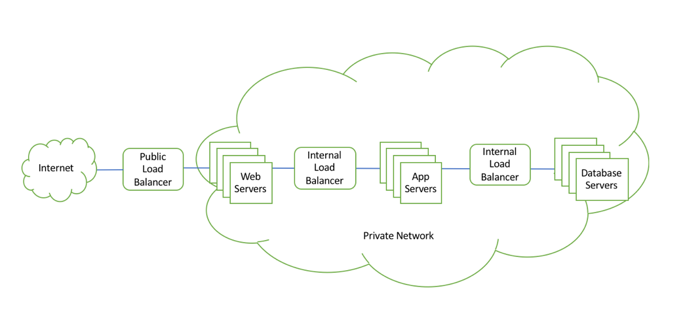
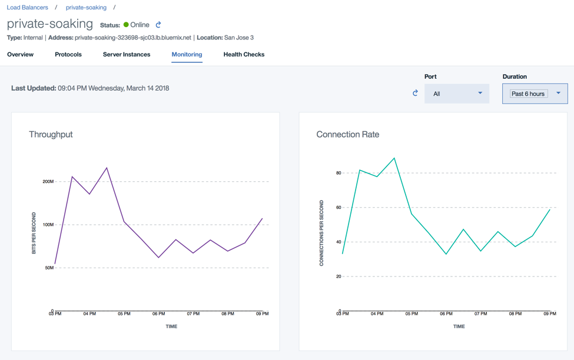

---

copyright:
  years: 2017
lastupdated: "2018-05-01"

---

{:shortdesc: .shortdesc}
{:new_window: target="_blank"}
{:codeblock: .codeblock}
{:pre: .pre}
{:screen: .screen}
{:tip: .tip}
{:download: .download}

# What's New

Find out about new and updated features in IBM Cloud Load Balancer.

## April 2018
### Horizontal Scaling
IBM Cloud Load Balancer now scales up automatically when load increases (and scales down as load decreases). When the load balancer is created, it starts with two appliances, but the number of appliances can go up (to 16, as of this writing) as our monitoring system detects an increase in the load. The IP addresses of each of the active appliances is added as DNS A-Records to the Fully Qualified Domain Name (FQDN) of the load balancer.

### Internal Load Balancer
A highly-demanded “Internal” version of our IBM Cloud Load Balancer is now available. This Load Balancer is not exposed publicly, but can still be used to load balance applications within their IBM Cloud private networks (in a multi-tiered deployment, for instance, as shown in the figure). It is both secure and consistent with the previous versions of IBM Cloud Load Balancer on the public side. 

### Monitoring Metrics
You can now leverage the “IBM Cloud Monitoring” service to monitor the following performance metrics associated with your load balancer and application:

* Throughput
* Connection rate
* Active connections

Up to two weeks of samples are collected and displayed by the load balancer web UI. The data can also be viewed on the IBM Cloud Monitoring service portal. If you require data for longer than two weeks, depending on the volume of other cloud metrics you may be sending to your Cloud Monitoring instance, you may need to upgrade your monitoring plan.

This feature requires your IBM Cloud IaaS and PaaS accounts to be linked, with a few [simple steps](https://console.bluemix.net/docs/account/linking_accounts.html#unifyingaccounts). 

### Cipher Suite Customization
You can now customize the cipher suites that are used when the load balancer is configured to perform SSL termination.

When you enable SSL termination on IBM Cloud Load Balancer (by selecting HTTPS as the front-end protocol), we enable a carefully selected default set of cipher suites that conform to best security practices. We keep a close watch on any new vulnerabilities that may be discovered, and update the list accordingly. This, along with seamless security updates of software and hardware components, helps to keep your applications secure at all times.